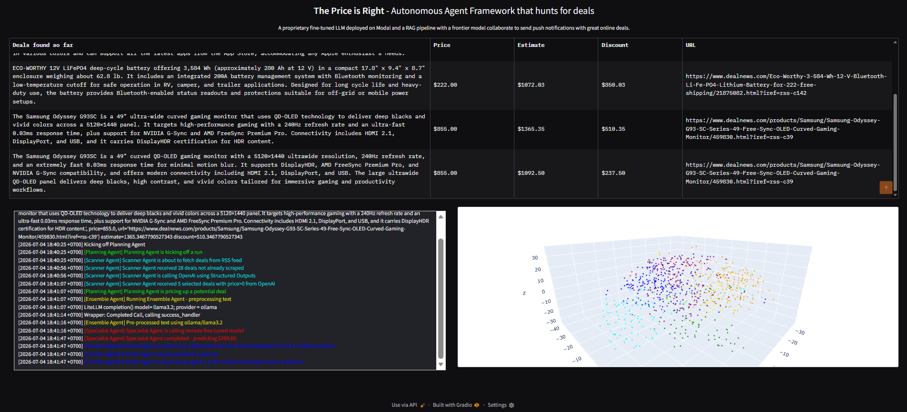
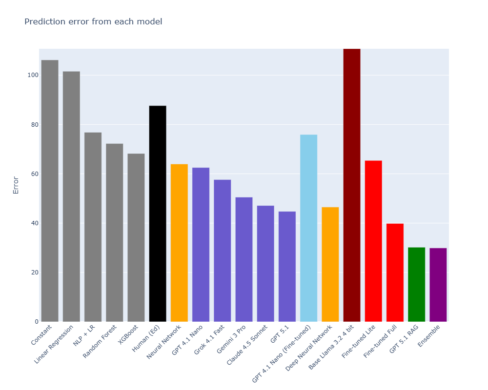

# The Price is Right: Autonomous E-commerce Deal Hunting Agent

[](https://www.python.org/downloads/release/python-3120/)
[](https://platform.openai.com/docs/assistants/overview)
[](https://modal.com/)
[](https://github.com/astral-sh/uv)

An autonomous, multi-agent system designed to hunt, evaluate, and notify users of highly profitable e-commerce deals in real-time. By orchestrating a hybrid ensemble of a RAG pipeline, a fine-tuned specialist LLM, and a Deep Neural Network, this system accurately predicts the true market value of products and alerts users when a significant discount is detected.

> **Note for Recruiters/Reviewers:** This project demonstrates advanced Agentic AI orchestration, serverless MLOps (via Modal), and rigorous performance benchmarking. 

---

## System UI & Live Demo




---

## System Architecture & Workflow

This system abandons the fragile "single-prompt" approach in favor of a robust **Multi-Agent Ensemble** architecture:

1. **Scanner Agent (Data Ingestion):** Continuously scrapes RSS feeds (e.g., Dealnews), sanitizing and structuring raw HTML into pure data objects.
2. **Planning Agent (The Brain):** Powered by GPT-5.1. It evaluates the stream, orchestrates sub-agents, and utilizes structured outputs to maintain predictable logic flows.
3. **The Ensemble Predictor (Core Pricing Engine):**
   - **RAG Agent (80% weight):** Uses ChromaDB to fetch historical pricing vectors and consults a Frontier Model for baseline estimation.
   - **Specialist Agent (10% weight):** A Llama 3.2 (3B) model heavily fine-tuned via QLoRA on 800k products. Deployed serverless on **Modal.com** with class-based volume caching to eliminate cold-start latency.
   - **Deep Neural Network (10% weight):** A traditional PyTorch DNN trained on tabular metadata to catch non-semantic numerical patterns.
4. **Messaging Agent:** Triggers Claude 4.5 Sonnet to craft concise, hype-driven push notifications and delivers them via Pushover API to the user's mobile device.

---

## Performance Benchmark

To demonstrate the efficacy of the Multi-Agent Ensemble, we benchmarked various approaches against the target continuous variable (Product Price). As visualized below, our hybrid approach significantly outperforms both human baselines and standalone frontier models.



*Figure: Mean Absolute Error (MAE) across different models. Lower is better.*

| Model / Approach | Mean Absolute Error (MAE) | Note |
| :--- | :---: | :--- |
| Human Expert Baseline | $87.62 | Manual estimation |
| Standalone GPT-5.1 | $44.74 | Zero-shot API call |
| GPT-5.1 + Base RAG | $30.19 | Grounded with ChromaDB |
| **Hybrid Ensemble (Our System)** | **$29.90** 🏆 | RAG + Fine-tuned Llama + PyTorch DNN |

---

## Project Structure

```text
price_is_right/
├── agents/                           # Core logic components and sub-agents
│   ├── agent.py                      # Base interface/class for all agents
│   ├── planning_agent.py             # (GPT-5.1) The central orchestrator 
│   ├── autonomous_planning_agent.py  # Handles the while-not-done autonomous loop
│   ├── scanner_agent.py              # Ingests and sanitizes RSS deals
│   ├── ensemble_agent.py             # Aggregates predictions from the 3 pricing models
│   ├── frontier_agent.py             # Executes the RAG pipeline query
│   ├── specialist_agent.py           # Calls the Fine-tuned Llama 3.2 on Modal
│   ├── neural_network_agent.py       # Interfaces with the local PyTorch model
│   ├── deep_neural_network.py        # PyTorch model architecture definition
│   ├── messaging_agent.py            # Formats and sends Pushover notifications
│   ├── preprocessor.py               # Data cleaning and formatting pipeline
│   ├── evaluator.py                  # Evaluates deal viability
│   ├── deals.py & items.py           # Pydantic schemas for structured data
├── products_vectorstore/             # ChromaDB SQLite and embeddings
├── deal_agent_framework.py           # High-level framework state management
├── price_is_right.py                 # Gradio UI and main execution entry point
├── deep_neural_network.pth           # Pre-trained PyTorch weights for the DNN component
├── pyproject.toml                    # Modern Python project configuration
├── uv.lock                           # Deterministic lockfile for exact reproducibility
└── memory.json                       # Agent's short-term memory state
```

---

## Quick Start (Reproducibility)

This project uses `uv` for ultra-fast, deterministic environment management. 

### 1. Prerequisites
- Install [uv](https://github.com/astral-sh/uv) (The rust-based Python package manager).
- Modal account (for Specialist Agent deployment).
- API Keys: OpenAI, Anthropic, Pushover.

### 2. Setup Environment
Clone the repository and install dependencies exactly as they were developed:

```bash
uv sync
```
### 3. Configure Secrets
Copy the example environment file and add your keys:

```bash
cp .env.example .env
```
### 4. Run the Dashboard
Launch the Gradio dashboard. The system will wait in a standby state until you trigger the hunting loop via the UI.

```bash
uv run price_is_right.py
```
*-----Built by Hung Tong-----*